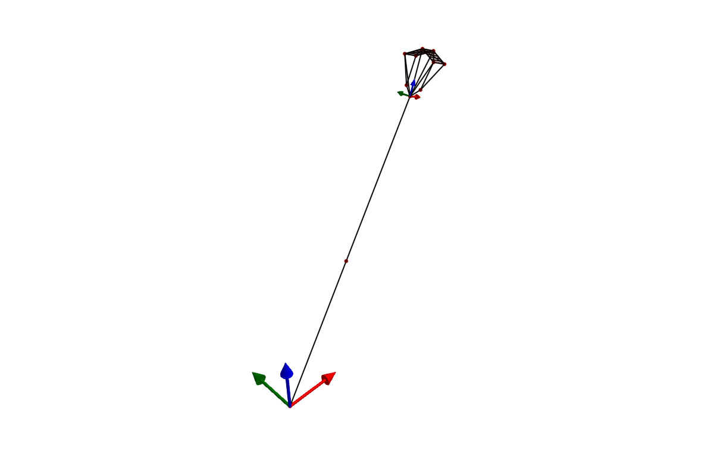

<!--
SPDX-FileCopyrightText: 2025 Uwe Fechner, Bart van de Lint
SPDX-License-Identifier: MPL-2.0
-->

# SymbolicAWEModels

[](https://OpenSourceAWE.github.io/SymbolicAWEModels.jl/stable)
[](https://OpenSourceAWE.github.io/SymbolicAWEModels.jl/dev)
[](https://github.com/OpenSourceAWE/SymbolicAWEModels.jl/actions/workflows/CI.yml)
[](https://codecov.io/gh/OpenSourceAWE/SymbolicAWEModels.jl)
[](https://github.com/JuliaTesting/Aqua.jl)
[](https://doi.org/10.5281/zenodo.19092013)

## Overview

**SymbolicAWEModels.jl** is a **compiler** for mechanical systems, built for
**Airborne Wind Energy** (AWE) modelling. It takes a structural description
of a system — defined in Julia code or a YAML file — and compiles it into
an efficient ODE problem using
[ModelingToolkit.jl](https://github.com/SciML/ModelingToolkit.jl).

```
 Define Components         Assemble             Compile            Simulate
┌──────────────────┐    ┌──────────────┐     ┌─────────────────┐     ┌────────────┐
│ Point, Segment,  │──▶│ System       │───▶│ SymbolicAWE     │───▶│ init!()    │
│ Wing, Winch, ... │    │ Structure    │     │ Model           │     │ next_step! │
│                  │    │              │     │ (symbolic eqs → │     │ sim!()     │
│ Julia or YAML    │    │ (resolves    │     │  ODEProblem)    │     │            │
│                  │    │  references) │     │                 │     │            │
└──────────────────┘    └──────────────┘     └─────────────────┘     └────────────┘
```

The first compilation is slow (minutes) as ModelingToolkit generates and
simplifies the symbolic equations. The result is cached to a binary file,
making subsequent runs fast (seconds).

### What can it model?

SymbolicAWEModels provides building blocks for flexible mechanical systems:

- **Point** masses — static, dynamic, or quasi-static nodes
- **Segment** spring-dampers — with per-unit-length stiffness, damping,
  and drag
- **Tether**s — collections of segments controlled by a winch
- **Winch**es — torque-controlled motors with Coulomb and viscous friction
- **Pulley**s — equal-tension constraints between segments
- **Wing**s — rigid body quaternion dynamics with aerodynamic forces from
  the [Vortex Step Method](https://github.com/Albatross-Kite-Transport/VortexStepMethod.jl)
- **Group**s — twist degrees of freedom for aeroelastic coupling
- **Transform**s — spherical coordinate positioning of components

These components can be combined to model a wide range of systems, from
simple hanging masses to complex kite power systems with multiple tethers,
bridles, and wings.

---

## Quick Start

Install Julia using [juliaup](https://github.com/JuliaLang/juliaup):

```bash
curl -fsSL https://install.julialang.org | sh
juliaup add release
juliaup default release
```

Create a project and add SymbolicAWEModels:

```bash
mkdir my_project && cd my_project
julia --project="."
```

```julia
using Pkg
pkg"add SymbolicAWEModels"
```

### Minimal example — a pendulum

```julia
using SymbolicAWEModels
SymbolicAWEModels.init_module(; force=false)
set_data_path("data/base")

set = Settings("system.yaml")
set.v_wind = 0.0

# Define components using symbolic names
points = [
    Point(:anchor, [0, 0, 0], STATIC),
    Point(:mass, [0, 0, -50], DYNAMIC; extra_mass=1.0),
]
segments = [Segment(:spring, set, :anchor, :mass, BRIDLE)]
transforms = [Transform(:tf, deg2rad(-80), 0.0, 0.0;
    base_pos=[0, 0, 50], base_point=:anchor, rot_point=:mass)]

# Assemble and compile
sys = SystemStructure("pendulum", set; points, segments, transforms)
sam = SymbolicAWEModel(set, sys)
init!(sam)

# Simulate
for _ in 1:100
    next_step!(sam)
end
```

For the full tutorial, see
[Building a System using Julia](https://OpenSourceAWE.github.io/SymbolicAWEModels.jl/dev/tutorial_julia/).
For YAML-based model definition, see
[Building a System using YAML](https://OpenSourceAWE.github.io/SymbolicAWEModels.jl/dev/tutorial_yaml/).

> **Note:** The first run will be slow (several minutes) due to
> compilation. Subsequent runs will be much faster thanks to binary
> caching.

See the [Getting Started Guide](https://OpenSourceAWE.github.io/SymbolicAWEModels.jl/dev/getting_started/)
for detailed instructions.

---

## Kite Models

SymbolicAWEModels provides the building blocks for assembling kite models
from YAML or Julia constructors. Ready-to-use kite models live in dedicated
packages:

- **[RamAirKite.jl](https://github.com/OpenSourceAWE/RamAirKite.jl)** —
  Ram air kite with bridle system, 4-tether steering, and deformable wing
  groups
- **[V3Kite.jl](https://github.com/OpenSourceAWE/V3Kite.jl)** — TU Delft
  V3 leading-edge-inflatable kite, YAML-based configuration

### 2-Plate Kite Example

A minimal coupled aero-structural model included in `data/2plate_kite/`:

```julia
using SymbolicAWEModels, VortexStepMethod
SymbolicAWEModels.init_module(; force=false)

set_data_path("data/2plate_kite")

# Sync aero geometry from structural geometry
struc_yaml = joinpath(get_data_path(), "quat_struc_geometry.yaml")
aero_yaml = joinpath(get_data_path(), "aero_geometry.yaml")
update_aero_yaml_from_struc_yaml!(struc_yaml, aero_yaml)

# Load settings and VSM configuration
set = Settings("system.yaml")
vsm_set = VortexStepMethod.VSMSettings(
    joinpath(get_data_path(), "vsm_settings.yaml"))

# Build system structure from YAML
sys = load_sys_struct_from_yaml(struc_yaml;
    system_name="2plate_kite", set, vsm_set)

sam = SymbolicAWEModel(set, sys)
init!(sam)

# Run with a steering ramp
for step in 1:600
    t = step * (10.0 / 600)
    ramp = clamp(t / 2.0, 0.0, 1.0)
    sam.sys_struct.segments[:kcu_steering_left].l0 -= 0.1 * ramp
    sam.sys_struct.segments[:kcu_steering_right].l0 += 0.1 * ramp
    next_step!(sam; dt=10.0/600, vsm_interval=1)
end
```



### Running examples

Copy examples to your project and run the interactive menu:

```julia
using SymbolicAWEModels
SymbolicAWEModels.init_module()
include("examples/menu.jl")
```

For visualization, `using GLMakie` enables the built-in plotting extension.
See the [Examples](https://OpenSourceAWE.github.io/SymbolicAWEModels.jl/dev/examples/)
page for details.

---

## Testing

Each component is tested in isolation using minimal models built from
constructors, with results verified against analytical solutions. This
proves that the underlying dynamics are physically correct — for
example, that angular momentum is conserved, that terminal velocity
matches the analytical prediction, and that spring-damper forces follow
the expected constitutive law.

```bash
# Run all tests
julia --project=. -e 'using Pkg; Pkg.test()'

# Run a specific test file
julia --project=test test/test_point.jl
```

| Test file | What it verifies |
|-----------|------------------|
| `test_point` | Gravity free-fall, damping, quasi-static equilibrium |
| `test_segment` | Spring-damper forces, stiffness, drag |
| `test_wing` | QUATERNION and REFINE wing construction, VSM coupling |
| `test_wing_dynamics` | Rigid body torque response, precession, angular momentum |
| `test_tether_winch` | Reel-out, Coulomb/viscous friction, terminal velocity |
| `test_pulley` | Equal-tension constraints, multi-segment pulleys |
| `test_transform` | Spherical coordinate positioning |
| `test_quaternion_conversions` | Quaternion ↔ rotation matrix |
| `test_quaternion_auto_groups` | Auto-generated twist DOFs |
| `test_principal_body_frame` | Principal vs body frame separation |
| `test_heading_calculation` | Kite heading from tether geometry |
| `test_section_alignment` | VSM section ↔ structural point mapping |
| `test_match_aero_sections` | Asymmetric aero/structural section matching, polar interpolation |
| `test_profile_law` | Atmospheric wind profile verification |
| `test_bench` | Performance regression tracking |

---

## Ecosystem

Key related packages:

- [RamAirKite.jl](https://github.com/OpenSourceAWE/RamAirKite.jl) — ram
  air kite model
- [V3Kite.jl](https://github.com/OpenSourceAWE/V3Kite.jl) — TU Delft V3
  kite model
- [KiteUtils.jl](https://github.com/OpenSourceAWE/KiteUtils.jl) — shared
  types and utilities
- [VortexStepMethod.jl](https://github.com/Albatross-Kite-Transport/VortexStepMethod.jl)
  — aerodynamic solver
- [AtmosphericModels.jl](https://github.com/aenarete/AtmosphericModels.jl)
  — wind profiles
- [KiteModels.jl](https://github.com/ufechner7/KiteModels.jl) —
  non-symbolic, predefined kite models
- [KiteSimulators.jl](https://github.com/aenarete/KiteSimulators.jl) —
  meta-package
- [KiteControllers.jl](https://github.com/aenarete/KiteControllers.jl) —
  control algorithms

Visualisation uses the built-in GLMakie extension
(`ext/SymbolicAWEModelsMakieExt.jl`) — just `using GLMakie` to enable
plotting.

- [Research Fechner](https://research.tudelft.nl/en/publications/?search=Fechner+wind&pageSize=50&ordering=rating&descending=true)
  — scientific background for winches and tethers


---

## Questions?

- Submit an [issue](https://github.com/OpenSourceAWE/SymbolicAWEModels.jl/issues/new)
- Start a [discussion](https://github.com/OpenSourceAWE/SymbolicAWEModels.jl/discussions/new/choose)
- Ask on [Julia Discourse](https://discourse.julialang.org/)
- Email Bart van de Lint: bart@vandelint.net

**Authors:**
Bart van de Lint (bart@vandelint.net)
Uwe Fechner (uwe.fechner.msc@gmail.com)
Jelle Poland

---

## License

This project is licensed under the [MPL-2.0 License](LICENSE).

---

## Citing SymbolicAWEModels

If you use SymbolicAWEModels in your research, please cite this repository:

```bibtex
@misc{SymbolicAWEModels,
  author = {Bart van de Lint, Uwe Fechner, Jelle Poland},
  title = {{SymbolicAWEModels}: Symbolic airborne wind energy system models},
  year = {2025},
  publisher = {GitHub},
  journal = {GitHub repository},
  howpublished = {\url{[https://github.com/OpenSourceAWE/SymbolicAWEModels.jl]}},
}
```

## Copyright Notice

Technische Universiteit Delft hereby disclaims all copyright interest in the package "SymbolicAWEModels.jl" (symbolic models for airborne wind energy systems) written by the Author(s).

Prof.dr. H.G.C. (Henri) Werij, Dean of Aerospace Engineering, Technische Universiteit Delft.

See copyright notices in the source files and the list of authors in [AUTHORS.md](AUTHORS.md).
