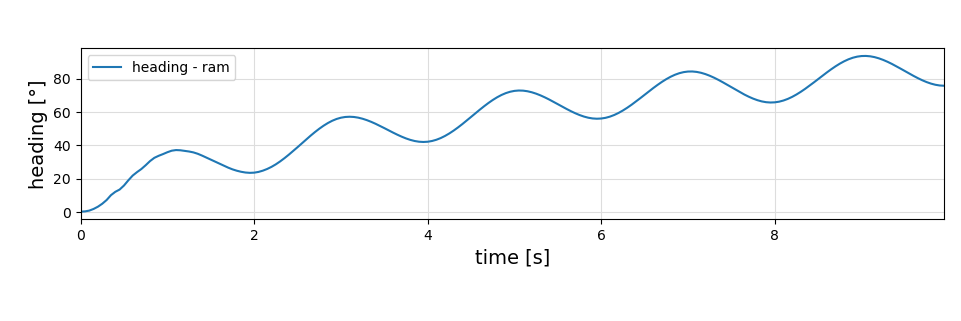
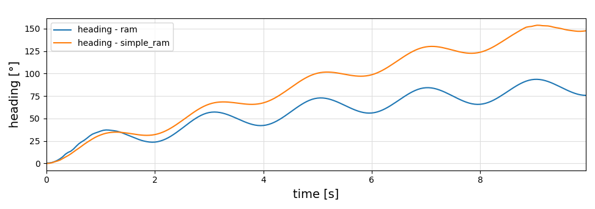

<!--
SPDX-FileCopyrightText: 2025 Uwe Fechner, Bart van de Lint
SPDX-License-Identifier: MPL-2.0
-->

# SymbolicAWEModels

[](https://OpenSourceAWE.github.io/SymbolicAWEModels.jl/stable)
[](https://OpenSourceAWE.github.io/SymbolicAWEModels.jl/dev)
[](https://github.com/OpenSourceAWE/SymbolicAWEModels.jl/actions/workflows/CI.yml)
[](https://codecov.io/gh/OpenSourceAWE/SymbolicAWEModels.jl)
[](https://github.com/JuliaTesting/Aqua.jl)

## Overview

**SymbolicAWEModels.jl** provides modular symbolic models for simulating Airborne Wind Energy (AWE) systems, including:

- One or more wings (kites)
- Tethers (with or without pulleys)
- Winches
- Bridle systems

The kite is modeled as a deforming rigid body with quaternion dynamics for orientation. Aerodynamic forces and moments are computed using the [Vortex Step Method](https://github.com/Albatross-Kite-Transport/VortexStepMethod.jl). Tethers are modeled as point masses connected by spring-damper elements with realistic drag. Winches are modeled as motors/generators that can reel tethers in/out.

### Modular Subcomponents

- **AtmosphericModel** from [AtmosphericModels.jl](https://github.com/aenarete/AtmosphericModels.jl)
- **WinchModel** from [WinchModels.jl](https://github.com/aenarete/WinchModels.jl)
- **Aerodynamics** via [VortexStepMethod.jl](https://github.com/Albatross-Kite-Transport/VortexStepMethod.jl)

This package is part of the Julia Kite Power Tools ecosystem:


---

## Installation

Install [Julia 1.11](https://julialang.org/install/) using `juliaup`.  
On Linux, make sure Python3 and Matplotlib are installed:

```bash
sudo apt install python3-matplotlib
```

**Recommended workflow:**

```bash
mkdir test
cd test
julia --project="."
```

Then add the package:

```julia
using Pkg
pkg"add SymbolicAWEModels"
```

Run the unit tests (can take about 60 minutes):

```julia
pkg"test SymbolicAWEModels"
```

Copy the examples, data and scripts to your project, and install dependencies:

```julia
using SymbolicAWEModels
SymbolicAWEModels.init_module(; force=false) # force=true to remove existing files with the same name
```

This adds extra packages needed for the examples and creates a `data` folder with example input files.

Run the interactive example menu:

```julia
include("examples/menu.jl")
```

Or run the ram-air-kite example directly:

```julia
include("examples/ram_air_kite.jl")
```

> **Note:** The first run will take a few minutes to precompile.

---

## Ram Air Kite Model

This model represents the kite as a deforming rigid body, with orientation governed by quaternion dynamics. Aerodynamics are computed via the Vortex Step Method. The kite is controlled from the ground via four tethers.

**Initialize:**

```julia
using SymbolicAWEModels, ControlPlots
set = Settings("system.yaml")
sam = SymbolicAWEModel(set, "ram")
init!(sam)
```

**Simulate and plot:**

```julia
(log, _) = sim_oscillate!(sam)
plot(sam.sys_struct, log; plot_all=false, plot_heading=true)
```



---

### Simple Ram Model

The `simple_ram` model removes the bridle system and uses 1-segment tethers. You can approximate its properties using the complex ram air kite model and a helper tether model.

**Initialize:**

```julia
init!(sam)
tether_sam = SymbolicAWEModel(set, "tether")
init!(tether_sam)
simple_sam = SymbolicAWEModel(set, "simple_ram")
init!(simple_sam)
```

**Simulate and plot:**

```julia
SymbolicAWEModels.copy_to_simple!(sam, tether_sam, simple_sam)
(simple_log, _) = sim_oscillate!(simple_sam)
plot(simple_sam.sys_struct, simple_log; plot_all=false, plot_heading=true)
```



---

## See Also

- [Research Fechner](https://research.tudelft.nl/en/publications/?search=Fechner+wind&pageSize=50&ordering=rating&descending=true) – scientific background for winches and tethers
- More kite models: [KiteModels.jl](https://github.com/ufechner7/KiteModels.jl)
- Meta-package: [KiteSimulators.jl](https://github.com/aenarete/KiteSimulators.jl)
- Utilities: [KiteUtils.jl](https://github.com/OpenSourceAWE/KiteUtils.jl)
- Component models: [WinchModels.jl](https://github.com/aenarete/WinchModels.jl), [KitePodModels.jl](https://github.com/aenarete/KitePodModels.jl), [AtmosphericModels.jl](https://github.com/aenarete/AtmosphericModels.jl)
- Controllers and viewers: [KiteControllers.jl](https://github.com/aenarete/KiteControllers.jl), [KiteViewers.jl](https://github.com/aenarete/KiteViewers.jl)
- Aerodynamics: [VortexStepMethod.jl](https://github.com/Albatross-Kite-Transport/VortexStepMethod.jl)

---

## Questions?

- Submit an [issue](https://github.com/OpenSourceAWE/SymbolicAWEModels.jl/issues/new)
- Start a [discussion](https://github.com/OpenSourceAWE/SymbolicAWEModels.jl/discussions/new/choose)
- Ask on [Julia Discourse](https://discourse.julialang.org/)
- Email Bart van de Lint: bart@vandelint.net

**Authors:**  
Bart van de Lint (bart@vandelint.net)  
Uwe Fechner (uwe.fechner.msc@gmail.com)

---

## License

This project is licensed under the [MPL-2.0 License](LICENSE).

---

## Citing SymbolicAWEModels

If you use SymbolicAWEModels in your research, please cite this repository:

```bibtex
@misc{SymbolicAWEModels,
  author = {Bart van de Lint, Uwe Fechner, Jelle Poland},
  title = {{SymbolicAWEModels}: Symbolic airborne wind energy system models},
  year = {2025},
  publisher = {GitHub},
  journal = {GitHub repository},
  howpublished = {\url{[https://github.com/OpenSourceAWE/SymbolicAWEModels.jl]}},
}
```

## Copyright Notice

Technische Universiteit Delft hereby disclaims all copyright interest in the package “SymbolicAWEModels.jl” (symbolic models for airborne wind energy systems) written by the Author(s).

Prof.dr. H.G.C. (Henri) Werij, Dean of Aerospace Engineering, Technische Universiteit Delft.

See copyright notices in the source files and the list of authors in [AUTHORS.md](AUTHORS.md).

**Documentation** [Stable Version](https://OpenSourceAWE.github.io/SymbolicAWEModels.jl/stable) --- [Development Version](https://OpenSourceAWE.github.io/SymbolicAWEModels.jl/dev)
