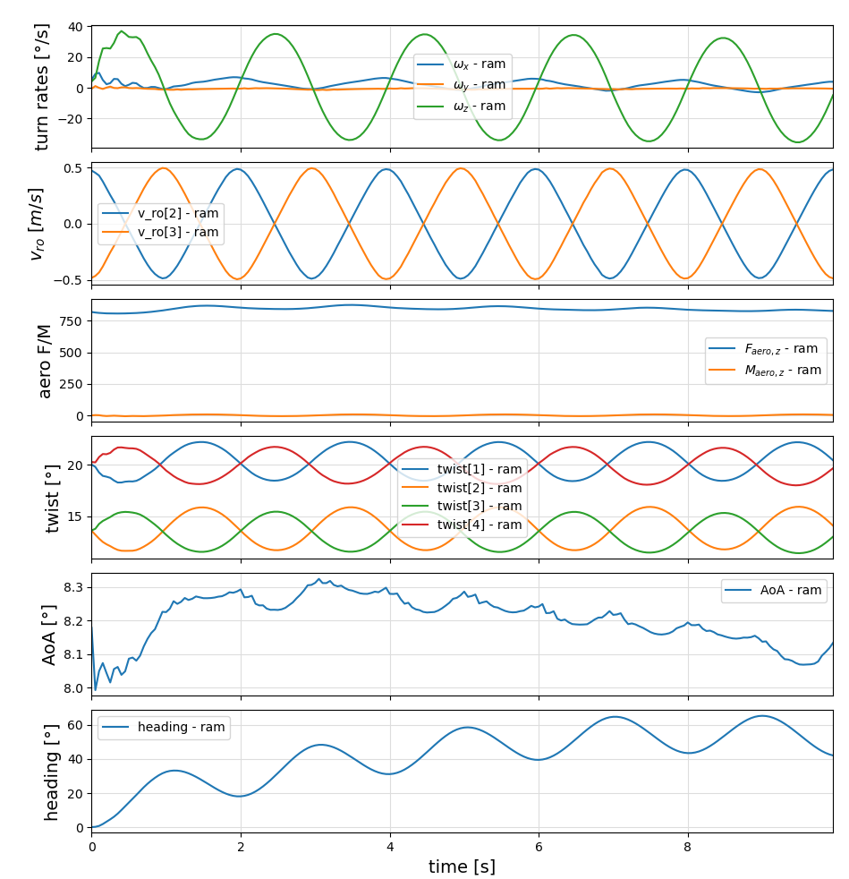
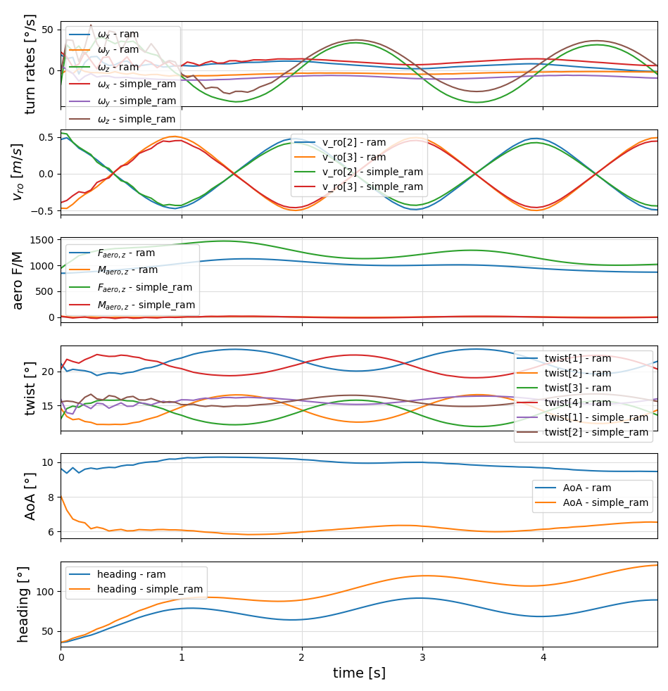

```@meta
CurrentModule = SymbolicAWEModels
```
# Examples for using the ram air kite model

## Create a test project
```bash
mkdir test
cd test
julia --project=.
```
Don't forget to type the dot at the end of the last line.
With the last command, we told Julia to create a new project in the current directory.

You can copy the examples, data and scripts to your project, and install dependencies
with the following lines:
```julia
using SymbolicAWEModels
SymbolicAWEModels.init_module(; force=false) # force=true to remove existing files with the same name
```

## Running the first example
```julia
include("examples/ram_air_kite.jl")
```
Expected output for first run:
```julia
[ Info: Loading packages 
[ Info: Precompiling SymbolicAWEModelsControlPlotsExt [986c3e0b-c4a6-5a67-87ac-f6b86e76af74] (cache mi
sses: include_dependency fsize change (2), wrong dep version loaded (14), mismatched flags (2))
Time elapsed: 24.149010176 s
[ Info: Creating SymbolicAWEModel:
Time elapsed: 38.51030329 s
[ Info: System initialized at:
Time elapsed: 120.861073757 s
[ Info: Generating oscillating steering commands...
[ Info: Starting simulation
┌ Info: Performance Summary:
│ Component    | Speedup (×)  | Total Time
│ -------------|--------------|------------
│ Simulation   |         2.34 |       2.14
│ Step         |         5.96 |       0.84
│ Integrator   |        34.15 |       0.15
└ VSM          |         2.62 |       1.91
[ Info: Simulated at:
Time elapsed: 213.981574478 s
[ Info: Plotted at:
Time elapsed: 220.05251771 s
220.05251771
```
After the second time it runs much faster, because the simplified ODE system is cached in the 
`model*.bin` file in the `data` folder and the deserialization is precompiled:
```julia
[ Info: Loading packages 
Time elapsed: 0.017465498 s
[ Info: Creating SymbolicAWEModel:
Time elapsed: 1.85496798 s
[ Info: System initialized at:
Time elapsed: 5.364508521 s
[ Info: Generating oscillating steering commands...
[ Info: Starting simulation
┌ Info: Performance Summary:
│ Component    | Speedup (×)  | Total Time
│ -------------|--------------|------------
│ Simulation   |         2.53 |       1.97
│ Step         |         6.61 |       0.76
│ Integrator   |        41.21 |       0.12
└ VSM          |         2.79 |       1.79
[ Info: Simulated at:
Time elapsed: 7.995500858 s
[ Info: Plotted at:
Time elapsed: 8.309523118 s
8.309523118
```

In this example, the kite is first stabilized, and then a sinus-shaped steering input is 
applied such that the kite is dancing in the sky.



## Running the second example
```julia
include("examples/simple_model.jl")
```

```julia
Tether 1: ω_n=227.039 rad/s,
                      T_s=0.1 s, 
                      ζ=0.1319, c=3.4209 Ns/m
Tether 2: ω_n=228.866 rad/s,
                      T_s=0.1 s, 
                      ζ=0.1309, c=3.4211 Ns/m
Tether 3: ω_n=235.585 rad/s,
                      T_s=0.1 s, 
                      ζ=0.1272, c=0.8549 Ns/m
Tether 4: ω_n=236.834 rad/s,
                      T_s=0.1 s, 
                      ζ=0.1265, c=0.8552 Ns/m
Summary of Results:
Tether 1: k = 2943.0749476475257 N/m, c = 3.4208593453647103 Ns/m
Tether 2: k = 2990.816045085089 N/m, c = 3.4210625600793843 Ns/m
Tether 3: k = 791.9269801315223 N/m, c = 0.8549123148071024 Ns/m
Tether 4: k = 800.5953494095929 N/m, c = 0.8551804418169453 Ns/m
[ Info: Generating oscillating steering commands...
[ Info: Starting simulation
┌ Info: Performance Summary:
│ Component    | Speedup (×)  | Total Time
│ -------------|--------------|------------
│ Simulation   |         1.99 |       1.25
│ Step         |         5.54 |       0.45
│ Integrator   |        24.27 |       0.10
└ VSM          |         2.59 |       0.97
[ Info: Generating oscillating steering commands...
[ Info: Starting simulation
┌ Info: Performance Summary:
│ Component    | Speedup (×)  | Total Time
│ -------------|--------------|------------
│ Simulation   |         0.46 |       5.44
│ Step         |        10.22 |       0.24
│ Integrator   |      1385.79 |       0.00
└ VSM          |         3.49 |       0.72
```

The simple model connects the tethers directly to the wing. In contrast, the default model 
features a more complex [speed system](https://kiteboarding.com/proddetail.asp?prod=ozone-r1v4-pro-tune-speedsystem-complete)
that uses pulleys and multiple attachment points. By 
matching key dynamic properties—such as the moment on the wing groups, stiffness, and 
damping—the simple model can be tuned to closely replicate the response of the more complex 
default model, at a much better performance.



## Linearization
The following example creates a nonlinear system model, finds a steady-state operating point, 
linearizes the model around this operating point and creates bode plots from inputs (torques)
to output (heading).
```julia
include("examples/lin_ram_model.jl")
```
See: [`lin_ram_model.jl`](https://github.com/OpenSourceAWE/SymbolicAWEModels.jl/blob/main/examples/lin_ram_model.jl)

