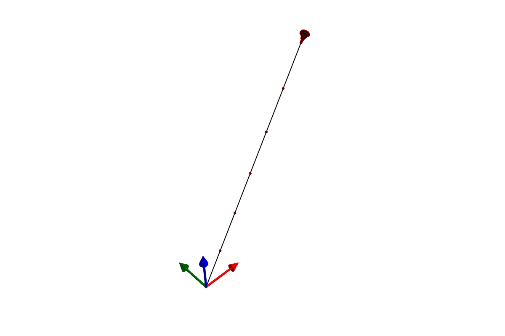

```@meta
CurrentModule = SymbolicAWEModels
```

# Examples

## Visualization with GLMakie

SymbolicAWEModels provides plotting functionality through a package extension that
automatically loads when you use GLMakie. Simply `using GLMakie` after loading
SymbolicAWEModels to enable all plotting functions.

```julia
using SymbolicAWEModels
using GLMakie  # Automatically loads the plotting extension
```

**3D system structure** — interactive visualization with clickable segments:
```julia
plot(sam.sys_struct)
```



**Time-series data** — multi-panel plots of simulation results:
```julia
(log, _) = sim_oscillate!(sam)
plot(sam.sys_struct, log; plot_default=true)
```

**Interactive replay** — scrub through a simulation with playback controls:
```julia
save_log(logger, "my_run")
syslog = load_log("my_run")
replay(syslog, sam.sys_struct)
```

**Record to video** — save a simulation as an MP4 file:
```julia
record(syslog, sam.sys_struct, "simulation.mp4"; framerate=30)
```

See the [Functions](exported_functions.md) page for plotting keyword arguments.

## Getting examples

**Registry users** — copy examples to your project:
```julia
using SymbolicAWEModels
SymbolicAWEModels.init_module()
include("examples/menu.jl")  # Interactive menu
```

**Cloned repository** — start Julia with the examples project:
```bash
julia --project=examples
```
```julia
using Pkg; pkg"dev ."  # First time only
include("examples/menu.jl")
```

## Structural examples

These examples demonstrate the building blocks without aerodynamics:

| Example | Description |
|---------|-------------|
| `structural/hanging_mass.jl` | Simplest possible system: a mass on a spring |
| `structural/catenary_line.jl` | Multi-segment tether hanging under gravity |
| `structural/simple_pulley.jl` | Two segments with a pulley constraint |
| `structural/pulley.jl` | Pulley system with winch control |
| `structural/saddle_form.jl` | Complex mesh demonstrating 3D structures |

## Coupled examples

These examples combine structural dynamics with aerodynamics. See the
[compilation pipeline](pipeline.md) page for how models are built and run.

### [2-Plate Kite](@id plate-kite-2)

This example loads the 2-plate kite from YAML geometry and runs a coupled
aerodynamic-structural simulation with a steering ramp:

```julia
using SymbolicAWEModels, VortexStepMethod

set_data_path("data/2plate_kite")

# Sync aero geometry from structural geometry
struc_yaml = joinpath(get_data_path(), "quat_struc_geometry.yaml")
aero_yaml = joinpath(get_data_path(), "aero_geometry.yaml")
update_aero_yaml_from_struc_yaml!(struc_yaml, aero_yaml)

# Load settings and VSM configuration
set = Settings("system.yaml")
vsm_set = VortexStepMethod.VSMSettings(
    joinpath(get_data_path(), "vsm_settings.yaml"))

# Build system structure from YAML
sys = load_sys_struct_from_yaml(struc_yaml;
    system_name="2plate_kite", set, vsm_set)

sam = SymbolicAWEModel(set, sys)
init!(sam)

# Run with a steering ramp
for step in 1:600
    t = step * (10.0 / 600)
    ramp = clamp(t / 2.0, 0.0, 1.0)
    sam.sys_struct.segments[:kcu_steering_left].l0 -= 0.1 * ramp
    sam.sys_struct.segments[:kcu_steering_right].l0 += 0.1 * ramp
    next_step!(sam; dt=10.0/600, vsm_interval=1)
end
```


See `coupled/2plate_kite.jl` for the full example with logging and replay.

### Ram air kite

The ram air kite model has been moved to
[RamAirKite.jl](https://github.com/OpenSourceAWE/RamAirKite.jl), which
provides a streamlined interface:

```julia
using RamAirKite, GLMakie

config = RamAirSimConfig(physical_model="ram", sim_time=10.0)
sam = create_ram_air_model(config)
init!(sam)
find_steady_state!(sam)
(log, _) = sim_oscillate!(sam)
plot(sam.sys_struct, log)
```

See `coupled/ram_air_kite.jl` for the full example.

### V3 kite (YAML-based)

This example loads the TU Delft V3 kite using [`load_sys_struct_from_yaml`](@ref):

```julia
using SymbolicAWEModels, VortexStepMethod

set_data_path("data/v3")
set = Settings("system.yaml")
vsm_set = VortexStepMethod.VSMSettings(
    "vsm_settings_reduced_for_coupling.yaml")

sys = load_sys_struct_from_yaml("struc_geometry.yaml";
    system_name="v3_kite", set=set,
    wing_type=QUATERNION, vsm_set=vsm_set)

sam = SymbolicAWEModel(set, sys)
init!(sam)
(log, _) = sim_oscillate!(sam)
```


See `coupled/v3_kite.jl` for the full example.

For comprehensive validation studies, see the dedicated validation packages:
- [Ram air kite validation](https://github.com/OpenSourceAWE/RamAirKiteValidation.jl) (coming soon)
- [V3 kite validation](https://github.com/OpenSourceAWE/V3KiteValidation.jl) (coming soon)

## Real-time visualization

The `realtime_visualization.jl` example demonstrates a custom simulation loop with
real-time 3D visualization using Makie observables. Key concepts:

- Create `Observable` objects for dynamic data (positions, orientations)
- Update observables in the simulation loop at a configurable interval
- Use sleep timing to maintain real-time pacing

Configuration:
- `realtime_factor`: Speed multiplier (2.0 = 2x speed)
- `plot_interval`: Update plot every N steps
- `dt`: Simulation time step

See `examples/realtime_visualization.jl` for the full implementation.
