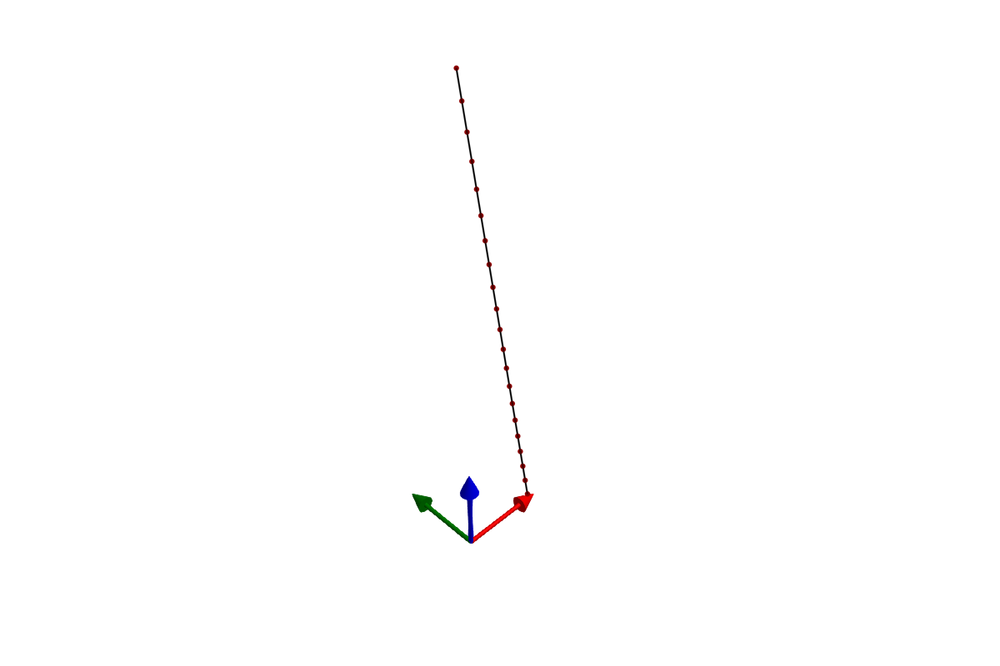
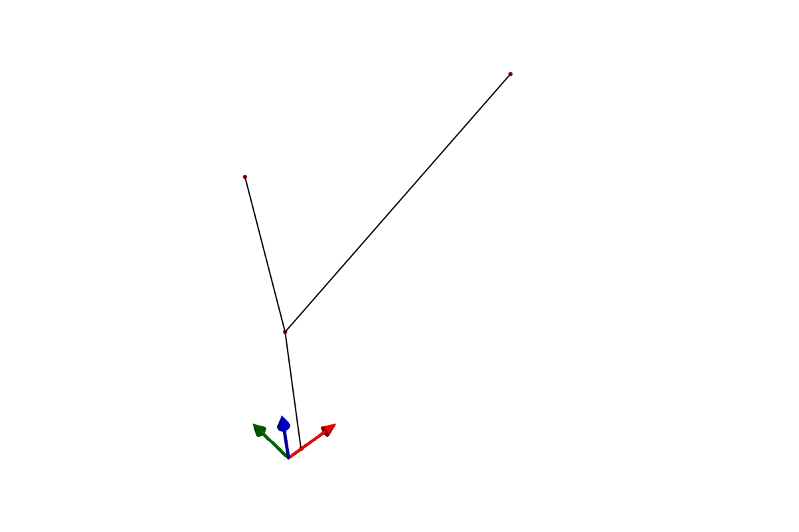

```@meta
EditURL = "literate/tutorial_julia.jl"
```

Copyright (c) 2025 Bart van de Lint, Jelle Poland
SPDX-License-Identifier: MPL-2.0

```@meta
CurrentModule = SymbolicAWEModels
```

# Building a system using Julia

This tutorial walks through building mechanical systems from scratch
using Julia constructors. Each component is created with a symbolic
name and assembled into a [`SystemStructure`](@ref), which is then
compiled into a simulation model.

## Overview

The construction workflow has four steps:

1. **Define components** — create [`Point`](@ref), [`Segment`](@ref),
   [`Transform`](@ref), and optionally [`Tether`](@ref),
   [`Winch`](@ref), [`Pulley`](@ref)
2. **Assemble** — pass components to [`SystemStructure`](@ref), which
   resolves all symbolic references (`:anchor` → index 1) and
   validates the structure
3. **Compile** — wrap in [`SymbolicAWEModel`](@ref), which generates
   symbolic equations via ModelingToolkit and compiles an `ODEProblem`
4. **Simulate** — call [`init!`](@ref) and [`next_step!`](@ref)

All components use symbolic names (`:anchor`, `:spring`, etc.) and
reference each other by name. The [`SystemStructure`](@ref)
constructor resolves these references to numeric indices
automatically. Integer indices are also supported for backwards
compatibility.

## Step 1: a simple tether

We start with the simplest possible system: a chain of point masses
connected by spring-damper segments, hanging under gravity.

```julia
using SymbolicAWEModels, VortexStepMethod

set = Settings("system.yaml")
set.solver = "FBDF"
set.v_wind = 1.0

n_segments = 20
l_tether = 50.0
```

First, define the points. The anchor is `STATIC` (fixed in space).
The intermediate points are `DYNAMIC` (governed by Newton's second
law). The tip point has some extra mass.

```julia
points = Point[]

push!(points, Point(:anchor, zeros(3), STATIC; transform=:tf))

for i in 1:n_segments
    pos = [0.0, 0.0, i * l_tether / n_segments]
    if i < n_segments
        push!(points, Point(Symbol("p_$i"), pos, DYNAMIC;
            transform=:tf))
    else
        push!(points, Point(:tip, pos, DYNAMIC;
            extra_mass=1.0, transform=:tf))
    end
end
```

There are four [`DynamicsType`](@ref)s:
- `STATIC` — the point does not move
- `DYNAMIC` — the point moves according to
  ``\ddot{\mathbf{r}} = \mathbf{F}/m``
- `QUASI_STATIC` — acceleration is constrained to zero (force
  equilibrium)
- `WING` — the point is rigidly attached to a wing body

Next, connect the points with [`Segment`](@ref)s. Each segment is
a spring-damper element with explicit stiffness and damping per
unit length.

```julia
unit_stiffness = 614600.0  # [N]
unit_damping = 473.0       # [Ns]
diameter = 0.002           # [m]

segments = Segment[]

for i in 1:n_segments
    p_i = points[i].name
    p_j = points[i+1].name
    push!(segments,
        Segment(Symbol("seg_$i"), p_i, p_j,
            unit_stiffness, unit_damping, diameter))
end
```

A [`Transform`](@ref) describes the initial orientation of the
system using spherical coordinates (elevation, azimuth, heading)
relative to a base position.

```julia
transforms = [Transform(:tf, deg2rad(-80), 0.0, 0.0;
    base_pos=[0.0, 0.0, 50.0],
    base_point=:anchor, rot_point=:tip)]
```

Now assemble everything into a [`SystemStructure`](@ref) and
visualize it:

```julia
sys_struct = SystemStructure("tether", set;
    points, segments, transforms)

plot(sys_struct)

```


If the system looks correct, compile and simulate:

```julia
sam = SymbolicAWEModel(set, sys_struct)
init!(sam)

logger = Logger(sam, 201)
sys_state = SysState(sam)
log!(logger, sys_state)

for i in 1:200
    next_step!(sam)
    update_sys_state!(sys_state, sam)
    log!(logger, sys_state)
end

save_log(logger, "tether_sim")
lg = load_log("tether_sim")
SymbolicAWEModels.record(lg, sam.sys_struct, "tether_sim.gif")
```


## Step 2: adding a winch

To control tether length, we group the segments into a
[`Tether`](@ref) and connect it to a [`Winch`](@ref). The winch
applies a torque to reel the tether in or out.

```julia
# Group all segments into a tether
seg_names = [s.name for s in segments]
tethers = [Tether(:main, seg_names; winch_point=:anchor)]

# Create a winch connected to the tether
gear_ratio = 1.0
drum_radius = 0.11       # [m]
f_coulomb = 122.0        # [N]
c_vf = 30.6              # [Ns/m]
inertia_total = 0.024    # [kgm²]

winches = [Winch(:winch, [:main],
    gear_ratio, drum_radius, f_coulomb, c_vf, inertia_total)]
```

Build and simulate with a constant torque of -20 Nm:

```julia
sys_struct = SystemStructure("winch", set;
    points, segments, tethers, winches, transforms)

```



```julia
sam = SymbolicAWEModel(set, sys_struct)
init!(sam)

logger = Logger(sam, 201)
sys_state = SysState(sam)
log!(logger, sys_state)

for i in 1:200
    next_step!(sam; set_values=[-20.0])
    update_sys_state!(sys_state, sam)
    log!(logger, sys_state)
end

save_log(logger, "winch_sim")
lg = load_log("winch_sim")
SymbolicAWEModels.record(lg, sam.sys_struct, "winch_sim.gif")
```


## Step 3: adding a pulley

A [`Pulley`](@ref) enforces length redistribution between two
segments that share a common point. This models a physical pulley
where the total rope length through the pulley is conserved.

```julia
set = Settings("system.yaml")
set.solver = "FBDF"
set.v_wind = 1.0
set.abs_tol = 1e-4
set.rel_tol = 1e-4
```

Create points — two static anchor points, and two dynamic points
forming the pulley system:

```julia
points = [
    Point(:left,   [0.0, 0.0, 2.0], STATIC),
    Point(:right,  [2.0, 0.0, 2.0], STATIC),
    Point(:pulley, [0.1, 0.0, 1.0], DYNAMIC),
    Point(:weight, [0.1, 0.0, 0.0], DYNAMIC; extra_mass=0.1),
]

segments = [
    Segment(:to_left,  :pulley, :left,
        unit_stiffness, unit_damping, diameter),
    Segment(:to_right, :pulley, :right,
        unit_stiffness, unit_damping, diameter),
    Segment(:hanging,  :pulley, :weight,
        unit_stiffness, unit_damping, diameter),
]
```

The pulley connects the two upper segments. When one gets shorter,
the other gets longer by the same amount:

```julia
pulleys = [Pulley(:pulley, :to_left, :to_right, DYNAMIC)]
```

Orient the system and build:

```julia
transforms = [Transform(:tf, deg2rad(0.0), 0.0, 0.0;
    base_pos=[1.0, 0.0, 4.0],
    base_point=:left, rot_point=:right)]

sys_struct = SystemStructure("pulley", set;
    points, segments, pulleys, transforms)

```



```julia
sam = SymbolicAWEModel(set, sys_struct)
init!(sam)

logger = Logger(sam, 201)
sys_state = SysState(sam)
log!(logger, sys_state)

for i in 1:200
    next_step!(sam)
    update_sys_state!(sys_state, sam)
    log!(logger, sys_state)
end

save_log(logger, "pulley_sim")
lg = load_log("pulley_sim")
SymbolicAWEModels.record(lg, sam.sys_struct, "pulley_sim.gif")
```


## Step 4: wings

Wings can be added via Julia constructors or YAML — both paths
produce the same [`SystemStructure`](@ref). See the
[2-Plate Kite example](examples.md#plate-kite-2) for a complete
wing system, and [VSM Coupling](vsm_coupling.md) for how
aerodynamic forces are computed.

## Named references

All component constructors accept symbolic names (`:anchor`,
`:spring`) or integer indices (`1`, `2`). Components reference each
other by name:

```julia
## Segment references points by name
Segment(:spring, :anchor, :mass, 1000.0, 50.0, 0.002)

## Tether references segments by name
Tether(:main, [:seg1, :seg2]; winch_point=:anchor)

## Winch references tethers by name
Winch(:winch, [:main], 1.0, 0.11, 122.0, 30.6, 0.024)

## Pulley references segments by name
Pulley(:pulley, :seg_a, :seg_b, DYNAMIC)

## Transform references points by name
Transform(:tf, 0.5, 0.0, 0.0; base_point=:anchor,
    rot_point=:tip, base_pos=[0, 0, 50])
```

The [`SystemStructure`](@ref) constructor resolves all names to
indices. After construction, you can access components by name:

```julia
sys.points[:anchor]       # Access point by name
sys.segments[:spring]     # Access segment by name
sys.winches[:winch]       # Access winch by name
```

## Component summary

| Type | Constructor | Purpose |
|------|------------|---------|
| [`Point`](@ref) | `Point(name, pos, type; ...)` | Mass node |
| [`Segment`](@ref) | `Segment(name, p_i, p_j, k, c, d; ...)` | Spring-damper |
| [`Tether`](@ref) | `Tether(name, segments; ...)` | Winch-controlled segments |
| [`Winch`](@ref) | `Winch(name, tethers, n, r, Fc, cv, I; ...)` | Torque-controlled motor |
| [`Pulley`](@ref) | `Pulley(name, seg_i, seg_j, type)` | Equal-tension constraint |
| [`Group`](@ref) | `Group(name, points, type, frac; ...)` | Wing twist section |
| [`Transform`](@ref) | `Transform(name, el, az, hdg; ...)` | Spherical positioning |

See the [Types](exported_types.md) page for full constructor
documentation.

---

*This page was generated using [Literate.jl](https://github.com/fredrikekre/Literate.jl).*

